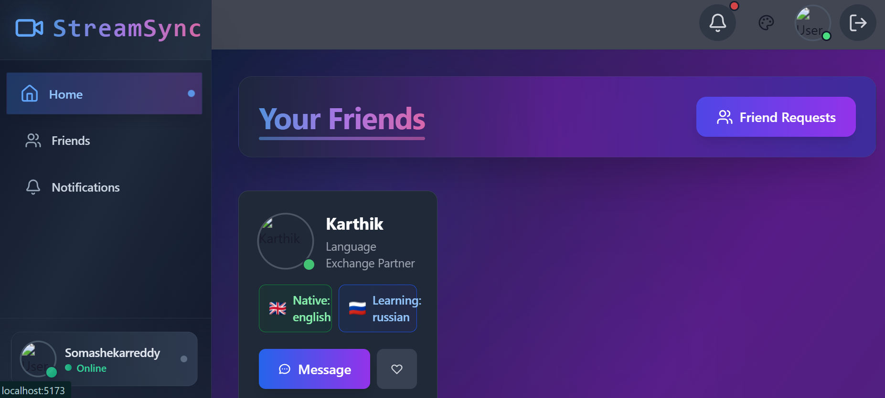
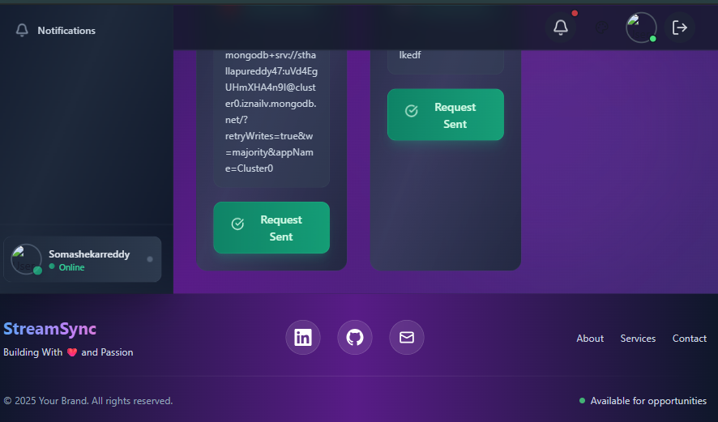

<h1 align="center">✨   MERN STACK Chat & Video Calling App ✨</h1>

### Clone this repo👇🏼👇🏼👇🏼👇🏼
git clone https://github.com/somashakerreddy/StreamSync-Real-Time-Video-Chat.git
Highlights:

- 🌐 Real-time Messaging with Typing Indicators & Reactions
- 📹 1-on-1 and Group Video Calls with Screen Sharing & Recording
- 🔐 JWT Authentication & Protected Routes
- 🌍 Language Exchange Platform with 32 Unique UI Themes
- ⚡ Tech Stack: React + Express + MongoDB + TailwindCSS + TanStack Query
- 🧠 Global State Management with Zustand
- 🚨 Error Handling (Frontend & Backend)
- 
- 🎯 Built with Scalable Technologies like Stream
-

## future Improvements
-- email Validation--
-- Forgot Password--


#### Create .env file in Frontend/Backend 

### Backend (`/backend`)

```
PORT=add your backend port Number
MONGO_URI=yourmonogoURL
STEAM_API_KEY=streamapapi_key from//getstream io website //Grab Your api sceret and api key from there
STEAM_API_SECRET=your_steam_api_secret
JWT_SECRET_KEY=your_jwt_secret
NODE_ENV=development
```

### Frontend (`/frontend`)

```
VITE_STREAM_API_KEY=your_stream_api_key //Grab from stream.io
```

---

## 🔧 Run the Backend

```bash
cd backend
npm install
npm run dev
```

## 💻 Run the Frontend

```bash
cd frontend
npm install
npm run dev
```

### ThankYou

---AnyQuires-- mailTo:thallapureddysomashakerreddy5@gmail.com
----MADE WITH LOVE❤ & PASSION---

#### ScreenShots...


   --Home Page--
 ---Responsive For All Screens---
  ---Footer--
